<table class="sphinxhide">
 <tr>
   <td align="center"><h1> Kria&trade; KR260 Robotics Starter Kit <br>ROS 2 Multi-Node Communications via TSN Tutorial</h1>
   </td>
 </tr>
 <tr>
 <td align="center"><h1>Setting up the Board and Application Deployment</h1>

 </td>
 </tr>
</table>

# Board Setup and Application Deployment

## Overview of updates

* Optional feature to Enable Frame Packet preemption

* Enablement to use another machine as a CNC to set QBV schedule and FDB Cam entries onto the 2 KR260/KD240 Nodes

## Introduction

This document shows how to set up the board and run the TSN ROS application.

## Pre-requisite

### Hardware Requirements

* Two Kria SOM starter kits which can be two KR260 Robotics Starter Kit or two KD240 Drive Starter Kits, or one KR260 and one KD240

* Two KR260 Power Supply & Adapter or two KD240 Power Supply & Adapter

* Cat 5e Ethernet Cable

* USB-A to micro-B Cable

* 16GB MicroSD Cards

* CNC - Optional (KV260/KR260/KD240 or Linux Running Standalone machine)

* Ethernet Switch - Optional

* [Digilent TPH2 Pmod - 12-pin Test Point Header](https://digilent.com/shop/pmod-tph2-12-pin-test-point-header/) - Optional (Sold Separately)

* [I210-T1 Network Adapter](https://www.amazon.com/gp/product/B00ESFF2JC/) installed on a PC host machine - Optional (Sold Separately)

* [Oscilloscope or Analog Discovery 2](https://digilent.com/reference/test-and-measurement/analog-discovery-2/start) – Minimum 100MS/s USB Oscilloscope - Optional (Sold Separately)

* RS485 Modbus Temperature Humidity Sensor - Optional (Sold Separately [here](https://www.aliexpress.com/item/33054683552.html) or [here](https://www.amazon.com/Temperature-Humidity-Sensor-Display-Modbus/dp/B078NRYBVZ))

* Digilent RS485 Pmod - High-speed Isolated Communications - Optional (Sold Separately [here](https://digilent.com/reference/pmod/pmodrs485/start))

* [12VDC Power Supply](https://digilent.com/shop/12v-3a-power-supply/) with Prototyping or Bare Terminals – Optional (Sold Separately)

* Two Digilent Pmod CAN devices - Optional for KR260 CAN testing only (Sold Separately [here](https://digilent.com/reference/pmod/pmodcan/start))

* Wireshark tools installed on host machine (Ubuntu 20.04 Linux used for documentation)

**NOTE**: This tutorial can be run with one KD240 and one KR260 configuration as well

### Tested Artifacts

Testing was performed with the following artifacts:

#### KD240 platform artifacts

| Component                          | Version                   |
|------------------------------------|---------------------------|
| Boot Firmware                      | K24-BootFW-01.01.bin      |
| Linux Kernel                       | 5.15.0-1030-xilinx-zynqmp |
| xlnx-firmware-kd240-motor-ctrl-qei | 0.12-0xlnx1               |

#### KR260 platform artifacts

| Component                          | Version                   |
|------------------------------------|---------------------------|
| Boot Firmware                      | K26-BootFW-01.01.bin      |
| Linux Kernel                       | 5.15.0-1030-xilinx-zynqmp |
| xlnx-firmware-kr260-tsn-rs485pmod  | 0.12-0xlnx1               |

Please refer to the [Kria Wiki](https://xilinx-wiki.atlassian.net/wiki/spaces/A/pages/1641152513/Kria+K26+SOM#Boot-Firmware-Updates)
to obtain latest linux image and boot firmware.

#### Application packages

| Package                        | Version                      |
| ------------------------------ | ---------------------------- |
| xlnx-tsn-utils                 | 0.3-0xlnx1                   |
| xlnx-app-kr260-tsn-examples    | 0.2-0xlnx2                   |
| xlnx-app-kr260-pmod-rs485-test | 0.1-0xlnx1                   |
| ros-humble-xlnx-pubsub         | 0.1.0-0jammy                 |
| ethtool                        | 1:5.16+tsn-qbr-0ubuntu1xlnx1 |
| lldpad                         | 1.1+tsn-qbr-0ubuntu1xlnx2    |

### Initial Setup

1. Go through the minimum setup required to boot Linux before continuing with instructions in this page:
    * [Kria Starter Kit Linux Boot on KR260](https://xilinx.github.io/kria-apps-docs/kr260/build/html/docs/kria_starterkit_linux_boot.html)
    * [Kria Starter Kit Linux Boot on KD240](https://xilinx.github.io/kria-apps-docs/kd240/linux_boot.html)

2. Get the latest TSN-ROS application and firmware package:

    * Search the package feed for packages compatible with KR260.

       ```bash
       sudo xmutil getpkgs
       ```

       An example output is shown below:
       ```bash
        Searching package feed for packages compatible with: kr260

        xlnx-app-kr260-mv-defect-detect/jammy 0.0.20220621.4729324-0xlnx3 arm64 demo application for Xilinx boards - kr260 mv-defect-detect application
        xlnx-app-kr260-pmod-rs485-test/jammy 0.1-0xlnx1 arm64  demo application for Xilinx boards - kr260 pmod-rs485-test application
        xlnx-app-kr260-tsn-examples/jammy 0.1-0xlnx1 arm64
       ```
       **NOTE**: There are no dedicated packages for KD240, the same TSN packages can be used as
        for KR260

    * Install the AMD demo application packages and dependencies for ROS-TSN.

        * Install firmware binaries and restart dfx-mgr.

        ```bash
        sudo apt install -y xlnx-firmware-kr260-tsn-rs485pmod          //KR260
        sudo apt install -y xlnx-firmware-kd240-motor-ctrl-qei         //KD240
        ```

        * Install dependencies and apps.

        ```bash
        # Install TSN applications below
        sudo apt install -y xlnx-app-kr260-pmod-rs485-test
        sudo apt install -y xlnx-app-kr260-tsn-examples
        ```

       Confirm with "Y" when prompted to install new or updated packages.

       > ***Note***: `linuxptp`, `xlnx-tsn-utils`, and `libmodbus5` are dependencies to TSN applications that are installed automatically with above commands.

    * Add the following path in the environment variable for an AMD demo application.

        ```bash
        export PATH=${PATH}:/opt/xilinx/pmod-rs485-test/bin/
        export PATH=${PATH}:/opt/xilinx/tsn-examples/bin/
        ```

        > ***Note:*** Consider adding the above commands to ~/.bashrc to avoid executing on every new shell created.

    * Install ROS 2 humble.

        Refer to [ROS 2 Documentation](https://docs.ros.org/en/humble/Installation/Ubuntu-Install-Debians.html) for the installation steps. Here is the snippet of what is needed for this application:

        ```bash
        sudo curl -sSL https://raw.githubusercontent.com/ros/rosdistro/master/ros.key -o /usr/share/keyrings/ros-archive-keyring.gpg
        echo "deb [arch=arm64 signed-by=/usr/share/keyrings/ros-archive-keyring.gpg] http://packages.ros.org/ros2-testing/ubuntu jammy main" | sudo tee /etc/apt/sources.list.d/ros2.list > /dev/null
        sudo apt update
        sudo apt upgrade
        sudo apt install -y ros-humble-ros-base
        ```

        Confirm with "Y" when prompted to install new or updated packages.

    * Install ROS 2 application.

       ```bash
        mkdir -p ~/Downloads
        wget https://github.com/Xilinx/ros-tsn-pubsub/releases/download/v0.1/ros-humble-xlnx-pubsub_0.1.0-0jammy_arm64.deb -P ~/Downloads/
        sudo apt install -y ~/Downloads/ros-humble-xlnx-pubsub_0.1.0-0jammy_arm64.deb
       ```

    * Install network-manager related packages.
       ```bash
        sudo apt install -y lldpad ethtool
       ```

3. Dynamically load the application package.

    The firmware consists of bitstream, device tree overlay (dtbo) file. The firmware is loaded dynamically on user request once Linux is fully booted. The xmutil utility can be used for that purpose.

    * Show the list and status of available acceleration firmware:

       ```bash
        sudo xmutil listapps
        ```

    * Switch to a different platform for different Application:

       When there is already another accelerator/firmware being activated apart from xlnx-app-kr260-pmod-rs485-test, unload it first and then switch to xlnx-app-kr260-pmod-rs485-test.

       ```bash
        sudo xmutil unloadapp
        sudo xmutil loadapp kr260-tsn-rs485pmod            //KR260
        sudo xmutil loadapp kd240-motor-ctrl-qei           //KD240
        ```
        **NOTE**: Though KD240 firmware is titled motor-ctrl-qei, it has the firmware for TSN.
        KD240 Firmware load `xmutil loadapp kd240-motor-ctrl-qei` will print following messages
        These are safe to ignore.
        ```bash
        [  112.802574] net eth1: Speed other than 10, 100
        [  112.807227] net eth1: or 1Gbps is not supported
        [  112.866305] net eth2: Speed other than 10, 100
        [  112.871168] net eth2: or 1Gbps is not supported
        ```

    * After installing the FW, execute xmutil listapps to verify that it is captured under the listapps function, and to have dfx-mgrd, re-scan and register all accelerators in the firmware directory tree

## Run Out Of Box Applications

The TSN example applications demonstrate Network Time Synchronization and Network Time Shaper Function that can be achieved through TSN based network infrastructure across a distributed system, which are two key features of the FPGA based TSN capabilities.

Two different configurations are shown below for deterministic communication. After completing the initial setup from above, you can navigate to the following subsections to evaluate the desired features:

* Master - Slave deterministic communication with 2 KR260/KD240 boards : Network Configuration 1
* KRS based DDS implementation on ROS 2 pub/sub definition : Network Configuration 1
* CNC(KV260/KR260/KD240 or Linux Running Machine) and Master - Slave with 2 KR260/KD240 boards : Network Configuration 2
* Master - Slave deterministic communication with I210 card 	 : Network Configuration 3
* RS485 Temperature/humidity sensor demo 						 : Communicating using RS485

**NOTE**: RS485 Temperature/humidity sensor demo is not applicable to KD240

### Network Configuration 1 : Two KR260/KD240 boards

**NOTE**: This turotial can be run with one KD240 and one KR260 configuration as well.

This configuration requires two KR260/KD240 units; TSN subsystem is connected to form a network where one of the units is configured to be master and the other one as slave. The following figure represents this configuration:

KR260-KR260 Setup:


KD240-KD240 Setup:


**NOTE**: For KD240 J24 is PS Eth, J25B top is PL Eth. For KR260 J10D is PS Eth, J10B top is PL Eth

#### Two KR260 boards: Board setup

* Connect Ethernet cable from PL ETH1 of Board1 (J10 top of KR260)/(J25B top of KD240) to PL ETH1 of  Board2.
* Connect JTAG/UART ports of both boards to your PC.
* Connect Digilent TPH2 Pmod into the PMOD2 connector on the KR260/KD240 board.
* The Analog Discovery 2  or Oscilloscope can be connected to Board1 and Board2 for observing the PTP clock synchronization, Qbv scheduling, and measuring latency.
* Power on both the boards with the prebuilt wic image in the sd_card that was prepared in the prerequisite section.

 KR260-KR260 Setup


KD240-KD240 Setup
  
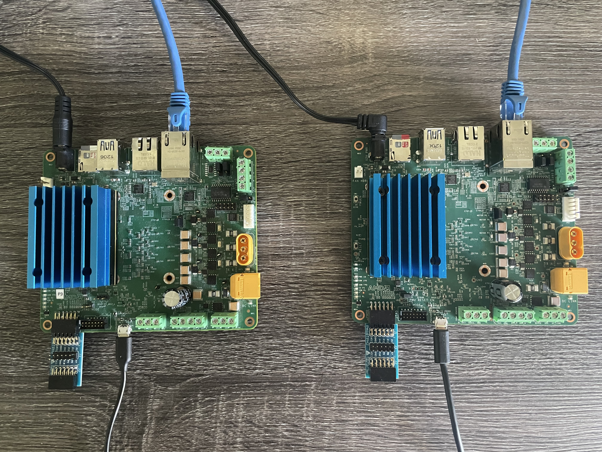

#### Run TSN-ROS Out of Box Applications

* Ensure to load the TSN accelerator/firmware (refer to step-7 'dynamically load the application package' from initial setup) before testing example application. If the firmware is already loaded, ignore this step and proceed.
    * KR260 firmware load command:
    ```bash
        sudo xmutil unloadapp
        sudo xmutil loadapp kr260-tsn-rs485pmod
    ```
    * KD240 firmware load command:
    ```bash
        sudo xmutil unloadapp
        sudo xmutil loadapp kd240-motor-ctrl-qei
    ```

* Setup Ethernet ports by running the following commands on the serial terminal. This sets the MAC/IP/VLAN on the EP and ETH ports of the TSN switch IP.

    * _KR260/KD240 Board1 interface setup_

        `source /usr/bin/net_setup.sh -b1`

    * _KR260/KD240 Board2 interface setup_

        `source /usr/bin/net_setup.sh -b2`

	* _Setup ros env on both KR260/KD240 Board 1 & Board2_

		`source /opt/ros/humble/setup.sh`

    > ***Note:*** Set MAC filters when using both TSN ethernet ports in the loopback mode. Refer to net_setup.sh script for setting MAC filters.

##### Network Time Synchronization KR260-KR260 (PTP Demo)

In this demo, Board1 sets its clock as master. Board2 is the slave. Board2 clock syncs with Board1 clock after a brief synchronization period.
Oscilloscope or Analog Discovery 2 Setup (optional)

* Connect P1 on the Test Pmod of Board1 to Channel1 of the oscilloscope - Monitors PTP clock on Board1
* Connect P1 on the Test Pmod of Board2 to Channel2 of the oscilloscope - Monitors PTP clock on Board2
* There are also additional signals exposed to the test Pmod if you want to observe them with additional oscilloscope channels:

    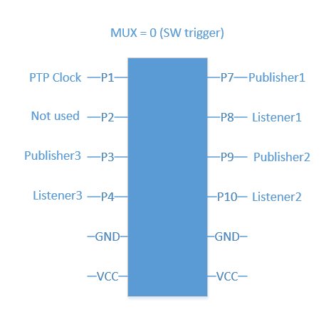

    * _Start ptp on Board1 in master mode_

        `source /usr/bin/start_ptp.sh -m`

    * _Start ptp on Board2 in slave mode_

        `source /usr/bin/start_ptp.sh -s`

    > ***Note:***  Ensure to run PTP master before starting PTP slave as slave fails to sync when the grandmaster clock is not set. The sync takes about 30 seconds to complete.

   **Observe Results:**

   * The file ptplog saves the ptp4l output on Board2. The rms value starts out high and goes down to a single-digit value showing the clocks are now in sync.

    

   *    To see the current status of PTP, run the following command:

        `tail -f .local/log/ptplog`

   * Using an Oscilloscope, or the Analog Discovery 2 and the WaveForms application, the clocks do not start out in sync but begin to sync with each other and this can be observed by the phase alignment between Channel1 and Channel2.

        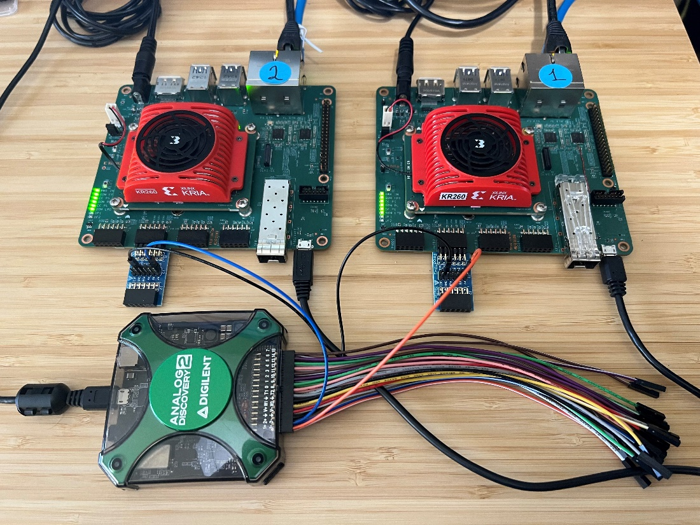

        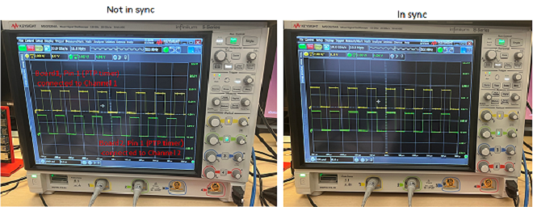

##### ROS Publisher and Subscriber Demo

* Start the Subscriber (listener) first on Board2 so that it is ready to receive messages from the Publisher once it has begun sending messages.

     `source /opt/xilinx/ros-tsn-example/bin/start_ros_test.sh -l`
* Start Publisher (talker) next on Board1 to begin sending messages to boards that are Subscribed to the topic.

    `source  /opt/xilinx/ros-tsn-example/bin/start_ros_test.sh -t`

**Observe Results**

* The xlnx-pubsub talker generates a packet of schedule traffic type every second.
* The xlnx-pubsub listener prints a message when it receives a packet.

    

##### Latency measurement Demo

To measure latency, an oscilloscope or Analog Discovery 2 device is required. This demo measures the latency between packet transmitted from Board1 and received on Board2. It includes the latency of the software stack as well.

#### Oscilloscope or Analog Discovery 2 Setup

* Connect P7 on the Test PMOD of Board1 to Channel1 of the oscilloscope - Monitors TX packet from Publisher1. Publisher1 can transmit a Scheduled Traffic (ST) packet or a Best effort (BE) packet.

* Connect P8 on the Test PMOD of Board2 to Channel2 of the oscilloscope - Monitors RX packet from Listener1. Listener 1 receives a ST packet or BE packet.

* Set up triggers on Channel1 and Channel2 with an OR condition and set the time scale interval to 50us.

    

    Figure: Test PMOD pins when MUX is set to SW trigger

   The talker application generates a packet, which triggers the Publisher1 pin in the previous figure. When the packet is received on Board2, the listener application triggers the Listener1 pin. Measure the time difference between Channel1 and Channel2 of the scope to find out the latency. It is ideally found to be between 80us to 160us.

    * _Start listener on Board2_

        `source /opt/xilinx/tsn-examples/bin/start_latency_test.sh -l`

    * _Start talker on Board1 with best effort traffic class_

        `source /opt/xilinx/tsn-examples/bin/start_latency_test.sh -b`

    * _Start talker on Board1 with scheduled traffic class_

        `source /opt/xilinx/tsn-examples/bin/start_latency_test.sh -s`

    * Press Enter key on Board2 to exit the Listener mode.

    **Observe Results**

    * The next steps measure the time difference between Channel1 and Channel2 of the scope to find out the latency. It is ideally found to be between 80us to 160us. The latency numbers are similar between Best Effort and Scheduled Traffic. If you set the Qbv priority, the latency might increase depending on the order of the slot (BE first or ST first) and Time allotted for each slot.

        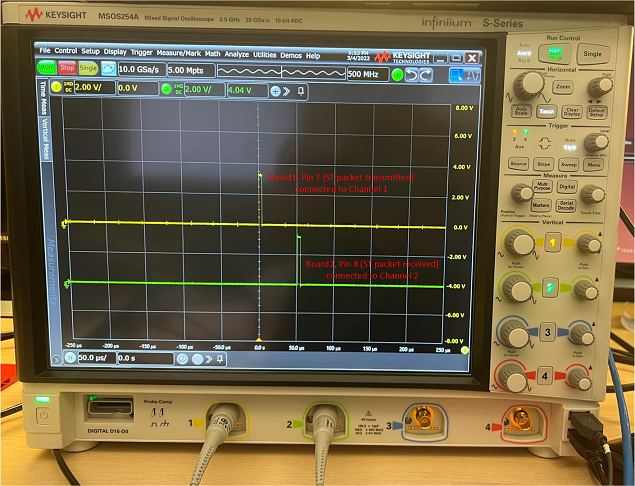

    > ***Note:*** The latency  measurement on the oscilloscope is from a software trigger. This includes the processing time of the processor to read the packet received over the network stack and initiates a trigger signal to the PMOD. When work load on the processor is high, latency measurements could reflect a higher value.

##### Network Time Shaper Function (802.1Qbv Demo)

This demo allots a time slot for scheduled traffic and best effort and it can be visualized on an oscilloscope. For a cycle time period of 1ms, ST traffic is sent for 700us and BE traffic for 300us.

**Oscilloscope or Analog Discovery 2 Setup**

* Connect P8 on the Test PMOD of **Board2** to Channel1 of the oscilloscope - ST packet Rx
* Connect P10 on the Test PMOD of **Board2** to Channel2 of the oscilloscope - BE packet Rx
* Set up triggers on Channel1 and Channel2 with an OR condition and set the time scale interval to 1 millisecond.


**Board2** listens for packets. On Board1, the application sets up time slots for the traffic classes.  It generates packets in continuous mode for both traffic types. The oscilloscope monitors the tlast signal of scheduled packets and best effort packets exposed by the TSN IP.

* _Start Receive on Board2_

    `source /opt/xilinx/tsn-examples/bin/start_qbv_test.sh -rx`
* _Start Transmit on Board1_

    `source /opt/xilinx/tsn-examples/bin/start_qbv_test.sh -tx`

    The talker on Board1 runs for 30 seconds and exits.

**Observe Results**

The scope shot shows a 70% Scheduled traffic 30 % Best Effort traffic distribution.


> ***Note:*** You can also monitor Tlast TX ST (P7) and  Tlast TX BE (P9) on Board1, but the distribution is not as clean as the RX because we are monitoring the data going into the TSN IP before it is scheduled to go out on the Ethernet MAC.

**No Oscilloscope Setup**

* No connections to the Pmods are required in this case since the oscilloscope is not used.  Instead, the Wireshark application is used to analyze traffic types.

* _Start Receive mode on Board2 and use tcpdump to begin capturing received packets_

    `source /opt/xilinx/tsn-examples/bin/start_qbv_test.sh -rx`

    `sudo tcpdump -i ep -w qbv.pcap`

* _Start Transmit mode on Board1_

    `source /opt/xilinx/tsn-examples/bin/start_qbv_test.sh -tx`

    The talker on Board1 runs for 30 seconds and exits automatically.

* Exit tcpdump using CTRL-c key combination to end capture on Board2.
* Move the qbv.pcap capture file to the SD card located under the /boot directory.
* Move the qbv.pcap file from the SD card to the host PC to analyze the packet distribution within Wireshark.

**Observe Results**

Wireshark trace shows a 70% Scheduled traffic 30 % Best Effort traffic distribution.

* Start Wireshark on the host PC. Use the one available under Ubuntu.

    `wireshark &`

* In the Wireshark GUI, select File → Open → Browse and select the qbv.pcap file.

* Observe that there are two sets of packets within the capture, one set with packet length=900, another set with packet length=800, which when plotted against time forms a 70:30 distribution. The packet length is based on the setting from the talker script. Below is an example of lengths 900 and 800 for Scheduled and Best Effort traffic, respectively.

    

* Click on a packet with length=900 bytes and observe the vlan ID=10, Priority (PCP/PRI=4) where a packet with PCP=4 indicates that it is Scheduled traffic.

    

* Click on a packet with length=800 bytes and observe the vlan ID=20, Priority (PCP/PRI=1) where a packet with PCP=1 indicates that it is Best Effort traffic.

    


### Network Configuration 2 : Network Manager(CNC) and Two KR260/KD240 Boards

**NOTE**: This tutorial can be run with one KD240 and one KR260 configuration as well.
Before running this tutorial please make sure that your `curl --version` package on the CNC is 
`7.68.0`. Please follow below steps if version does not match:
```bash
    sudo apt-cache policy curl
    sudo apt remove curl
    sudo apt install -y --no-install-recommends curl=7.68.0-1ubuntu2.18
```

This configuration requires either two KR260/KD240 units and one KV260/KR260/KD240 unit(CNC) or two KR260/KD240 units and one Linux Running Machine(CNC). The following images represent these configurations:

#### Two KR260/KD240 and one KV260/KR260/KD240(CNC):

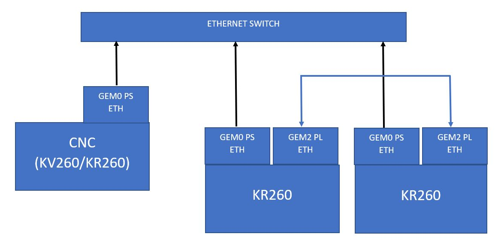

#### Two KR260/KD240 and one Linux Running Machine(CNC):

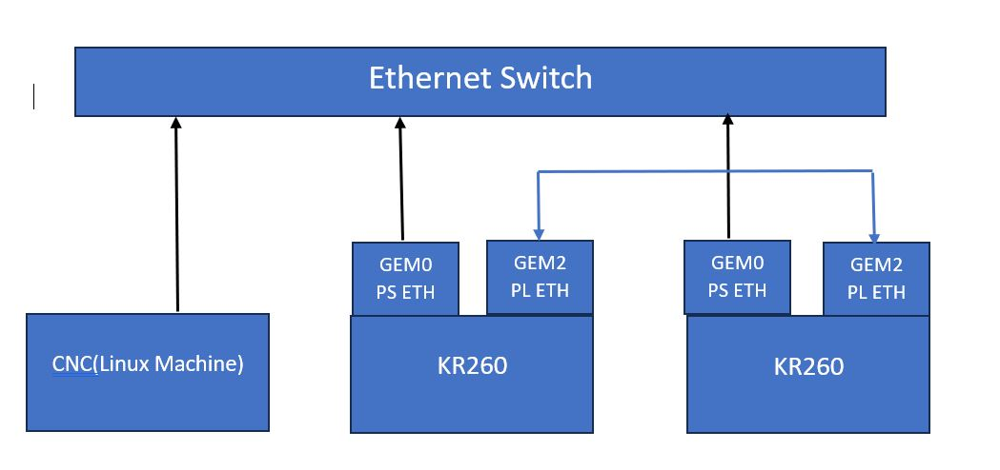

**NOTE**: For KD240 J24 is PS Eth, J25B top is PL Eth. For KR260 J10D is PS Eth, J10B top is PL Eth

#### Run TSN-ROS Out of Box Applications

* Ensure to load the TSN accelerator/firmware (refer to step-7 'dynamically load the application package' from initial setup) before testing example application. If the firmware is already loaded, ignore this step and proceed.
    * KR260 firmware load command:
    ```bash
        sudo xmutil unloadapp
        sudo xmutil loadapp kr260-tsn-rs485pmod
    ```
    * KD240 firmware load command:
    ```bash
        sudo xmutil unloadapp
        sudo xmutil loadapp kd240-motor-ctrl-qei
    ```

* Setup Ethernet ports by running the following commands on the serial terminal. This sets the MAC/IP/VLAN on the EP and ETH ports of the TSN switch IP.

    * _KR260/KD240 Board1 interface setup_

        `source /usr/bin/net_setup.sh -b1`

    * _KR260/KD240 Board2 interface setup_

        `source /usr/bin/net_setup.sh -b2`


##### Run Instructions

1. Run parser on the both KR260/KD240 units.

    * Setup one board as Master and one as Slave. Run the following:
     ```bash
        source /usr/bin/network-manager/tsn-parsers/xnm.sh -m &          // on Board1/Master
        source /usr/bin/network-manager/tsn-parsers/xnm.sh -s &          // on Board2/Slave
     ```

2. Setup Network Manager

    * For CNC as KR260/KV260/KD240, install xlnx-tsn-utils package.
    ```bash
        sudo add-apt-repository ppa:xilinx-apps
        sudo apt update
        sudo apt -y install xlnx-tsn-utils
    ```

    * For CNC as a Linux Machine, clone and install this [repo](https://github.com/Xilinx/tsn-utils).
    ```bash
        git clone https://github.com/Xilinx/tsn-utils.git
        cd tsn-utils/tsn-networkmanager
        sudo make install
    ```

    * Discover the two nodes by pinging them.
      ```bash

        ping -c 3 10.0.0.106                                            //Board1 or Master

        PING 10.0.0.106 (10.0.0.106) 56(84) bytes of data.
        64 bytes from 10.0.0.106: icmp_seq=1 ttl=64 time=0.242 ms
        64 bytes from 10.0.0.106: icmp_seq=2 ttl=64 time=0.200 ms
        64 bytes from 10.0.0.106: icmp_seq=3 ttl=64 time=0.203 ms

        --- 10.0.0.106 ping statistics ---
        3 packets transmitted, 3 received, 0% packet loss, time 2047ms
        rtt min/avg/max/mdev = 0.200/0.215/0.242/0.019 ms

        ping -c 3 10.0.0.208                                           //Board2 or Slave

        PING 10.0.0.208 (10.0.0.208) 56(84) bytes of data.
        64 bytes from 10.0.0.208: icmp_seq=1 ttl=64 time=0.242 ms
        64 bytes from 10.0.0.208: icmp_seq=2 ttl=64 time=0.200 ms
        64 bytes from 10.0.0.208: icmp_seq=3 ttl=64 time=0.203 ms

        --- 10.0.0.208 ping statistics ---
        3 packets transmitted, 3 received, 0% packet loss, time 2047ms
        rtt min/avg/max/mdev = 0.200/0.215/0.242/0.019 ms
      ```

    * Run the CNC setup script from the install location to create/modify nodes:
      ```
        sudo /usr/bin/network-manager/xcnc_setup
      ```

    * If a node is not already created, navigate through the options and create two new nodes using Master's and Slave's MAC Address(eth1).
      ```
        #Example

        ubuntu@kria:~$ sudo /usr/bin/network-manager/xcnc_setup

                                      Hi!
                  Welcome to the TSN Network Management Engine

        Please choose one of the options below:
        Option 1: Create new node
        Option 2: Modify existing node
        Option 3: Show current nodes
        Option 4: Exit
        Please enter a number:
        1
        Please enter the node's MAC address
        00:0a:35:10:37:fa                           //Board1 or Master
        Creating new node
        Please choose one of the options below:
        Option 1: Create new node
        Option 2: Modify existing node
        Option 3: Show current nodes
        Option 4: Exit
        Please enter a number:
        1
        Please enter the node's MAC address
        00:0a:35:10:39:c2                           //Board2 or Slave
        Creating new node
        Please choose one of the options below:
        Option 1: Create new node
        Option 2: Modify existing node
        Option 3: Show current nodes
        Option 4: Exit
        Please enter a number:
        2
        Nodes currently added:
        node_000a351037fa                           //Board1 or Master
        node_000a351039c2                           //Board2 or Slave
      ```
      ***Note***: Do not exit and follow next steps.

    * On CNC, set qbv configs for swp0 for Board1/Master(70% Scheduled traffic and 30% Best Effort traffic)
        * cycle_time in to be entered nS. Max cycle time is 1sec.
        * cycle start time. Should be '0,' which starts traffic as soon as the talker is running.
        * gate list length can have MAX 256 entries. (gate list length > 0).
        * time for gate list entry to be entered in nS, should not be more the 8000000nS. Sets the time for which gate-state-value that is set will occupy (time > 0).
      ```
        # Example

        ubuntu@kria:~$ sudo /usr/bin/network-manager/xcnc_setup

                                      Hi!
                  Welcome to the TSN Network Management Engine
        Please choose one of the options below:
        Option 1: Create new node
        Option 2: Modify existing node
        Option 3: Show current nodes
        Option 4: Exit
        Please enter a number:
        2

        Please enter the node's MAC address
        00:0a:35:10:37:fa                                   //Board1 or Master
        /etc/tsn-networkmanager/node_000a351037fa
        Qbv/fdb?
        qbv
        Enter the switch port whose qbv schedule needs to be modified:
        swp0
        Enter cycle time in nanoseconds, Maximum cycle time is 1 sec
        1000000
        Enter cycle start time (base time)
        0
        Enter gate list length:
        2
        Entry 1
        To open BE use state : 1
        To open ST use state : 4
        To open RES use state : 2
        Open both ST & BE state: 5(1+4)
        Enter gate state value
        4
        Enter time for the gate list entry
        700000
        Entry 2
        To open BE use state : 1
        To open ST use state : 4
        To open RES use state : 2
        Open both ST & BE state: 5(1+4)
        Enter gate state value
        1
        Enter time for the gate list entry
        300000
        10.0.0.106               ether   00:0a:35:10:37:fa   C                     eth0

        Sending /etc/tsn-networkmanager/node_000a351037fa/node_000a351037fa_qbv.json

        curl -T /etc/tsn-networkmanager/node_000a351037fa/node_000a351037fa_qbv.json tftp://10.0.0.106
        % Total    % Received % Xferd  Average Speed   Time    Time     Time  Current
                                 Dload  Upload   Total   Spent    Left  Speed
        100  9374    0     0  100  9374      0   767k --:--:-- --:--:-- --:--:--  767k
        100  9374    0     0  100  9374      0   746k --:--:-- --:--:-- --:--:--  746k
      ```
      ***Note***: Do not exit and set fdb configs.

    * On CNC, set fdb configs for both the nodes.
        * While creating "fdb," configs destmac should be "e0:e0:e0:e0:e0:e0", vlan ID should be 10, port should be swp1 for Master configs, and swp0 for Slave configs.
      ```
      # Example configs for Board1/Master

      ubuntu@kria:~$ sudo /usr/bin/network-manager/xcnc_setup

                                    Hi!
                  Welcome to the TSN Network Management Engine
        Please choose one of the options below:
        Option 1: Create new node
        Option 2: Modify existing node
        Option 3: Show current nodes
        Option 4: Exit
        Please enter a number:
        2
        Nodes currently added:
        node_000a351037fa                           //Board1 or Master
        node_000a351039c2                           //Board2 or Slave


        Please enter the node's MAC address
        00:0a:35:10:37:fa                           //Board1 or Master
        /etc/tsn-networkmanager/node_000a351037fa
        Qbv/fdb?
        fdb
        Please enter a destination MAC address for the CAM entry
        e0:e0:e0:e0:e0:e0
        Please enter a vlan ID(s)/range of vlan's for the CAM Entry
        10
        Please specify destination switch port/s:
        swp0: 3, swp1: 1, swp2: 2
        Multiple ports can be specified using a comma separated string
        1
        Static CAM entry added locally, Want to add more entries [Y/N]? If you enter N/n, device will be programmed immediately
        n
        10.0.0.106               ether   00:0a:35:10:37:fa   C                     eth0

        Sending /etc/tsn-networkmanager/node_000a351037fa/node_000a351037fa_fdb.json

        curl -T /etc/tsn-networkmanager/node_000a351037fa/node_000a351037fa_fdb.json tftp://10.0.0.106
        % Total    % Received % Xferd  Average Speed   Time    Time     Time  Current
                                 Dload  Upload   Total   Spent    Left  Speed
        100  2574    0     0  100  2574      0   440k --:--:-- --:--:-- --:--:--  440k
        100  2574    0     0  100  2574      0   414k --:--:-- --:--:-- --:--:--  414k

        # Example configs for Board2/Slave

      ubuntu@kria:~$ sudo /usr/bin/network-manager/xcnc_setup

                                    Hi!
                  Welcome to the TSN Network Management Engine
        Please choose one of the options below:
        Option 1: Create new node
        Option 2: Modify existing node
        Option 3: Show current nodes
        Option 4: Exit
        Please enter a number:
        2
        Nodes currently added:
        node_000a351037fa                           //Board1 or Master
        node_000a351039c2                           //Board2 or Slave


        Please enter the node's MAC address
        00:0a:35:10:39:c2                           //Board1 or Master
        /etc/tsn-networkmanager/node_000a351037fa
        Qbv/fdb?
        fdb
        Please enter a destination MAC address for the CAM entry
        e0:e0:e0:e0:e0:e0
        Please enter a vlan ID(s)/range of vlan's for the CAM Entry
        10
        Please specify destination switch port/s:
        swp0: 3, swp1: 1, swp2: 2
        Multiple ports can be specified using a comma separated string
        3
        Static CAM entry added locally, Want to add more entries [Y/N]? If you enter N/n, device will be programmed immediately
        n
        10.0.0.208               ether   00:0a:35:10:39:c2   C                     eth0

        Sending /etc/tsn-networkmanager/node_000a351037fa/node_000a351037fa_fdb.json

        curl -T /etc/tsn-networkmanager/node_000a351037fa/node_000a351037fa_fdb.json tftp://10.0.0.208
        % Total    % Received % Xferd  Average Speed   Time    Time     Time  Current
                                 Dload  Upload   Total   Spent    Left  Speed
        100  2574    0     0  100  2574      0   440k --:--:-- --:--:-- --:--:--  440k
        100  2574    0     0  100  2574      0   414k --:--:-- --:--:-- --:--:--  414k
      ```
      ***Note***: Exit after setting fdb configs.

3. Run Traffic
    * Verify if the schedule is set for ep(swp0) on Board1/Master.
    ```
        sudo qbv_sched -g ep

        List length: 2
        Cycle time: 1000000
        Base time: 1684277666s 0ns
        List 0: Gate State: 4 Gate Time: 700000ns
        List 1: Gate State: 1 Gate Time: 300000ns
    ```
    * Start talker on Board1/Master
     ```
        sudo tsn_talker -n -1 -l 900 -v 10 -p 4 &       //for ST Traffic
        sudo tsn_talker -n -1 -l 900 -v 10 -p 1 &       //for BE Traffic
     ```
    * Start capture of received packets on Board2/Slave
     ```
        sudo tcpdump -i ep -w qbv.pcap -vvv

        tcpdump: listening on ep, link-type EN10MB (Ethernet), snapshot length 262144 bytes
        ^C696566 packets captured
        768225 packets received by filter
        71379 packets dropped by kernel
     ```
     ***Note***: Packet count should increment quickly as soon as you run the tcpdump command.

    * Exit out of tcpdump after a few seconds using the CTRL-c key combination to end capture on Board2.

    * qbv.pcap file saved in the current directory shows packet distribution.

    * Move the qbv.pcap file from the SD card to the host PC to analyze the packet distribution within Wireshark.

    * Kill talker on Board1/Master
    ```
        sudo killall tsn_talker
    ```

4. Analyze the packet distribution on wireshark

    Wireshark trace shows a 70% Scheduled traffic 30 % Best Effort traffic distribution

    * Start Wireshark on the host PC
    ```
        # For Linux

        wireshark &
    ```
    For Windows, download [Wireshark](https://www.wireshark.org/download.html).
    * In the Wireshark GUI, select File → Open → Browse and select the qbv.pcap file.

    * Observe that there are packets within the capture, with packet length=900
    .

    * Type the filter as 'vlan.priority == 4' in "Apply display filter" in Wireshark.

    * Click on a packet and observe the vlan ID=10, Priority (PCP/PRI=4) where a packet with PCP=4 indicates it is Scheduled traffic
    .

    * Select the following from Wireshark Tab Statistics -> Capture File Properties. You can see ~70% distribution for ST traffic
    .

    * Type the filter as 'vlan.priority == 1' in "Apply display filter" in Wireshark.

    * Click on a packet and observe the vlan ID=4, Priority (PCP/PRI=1) where a packet with PCP=1 indicates it is Best Effort traffic
    .

    * Select the following from Wireshark Tab Statistics -> Capture File Properties. You can see ~30% distribution for BE traffic
    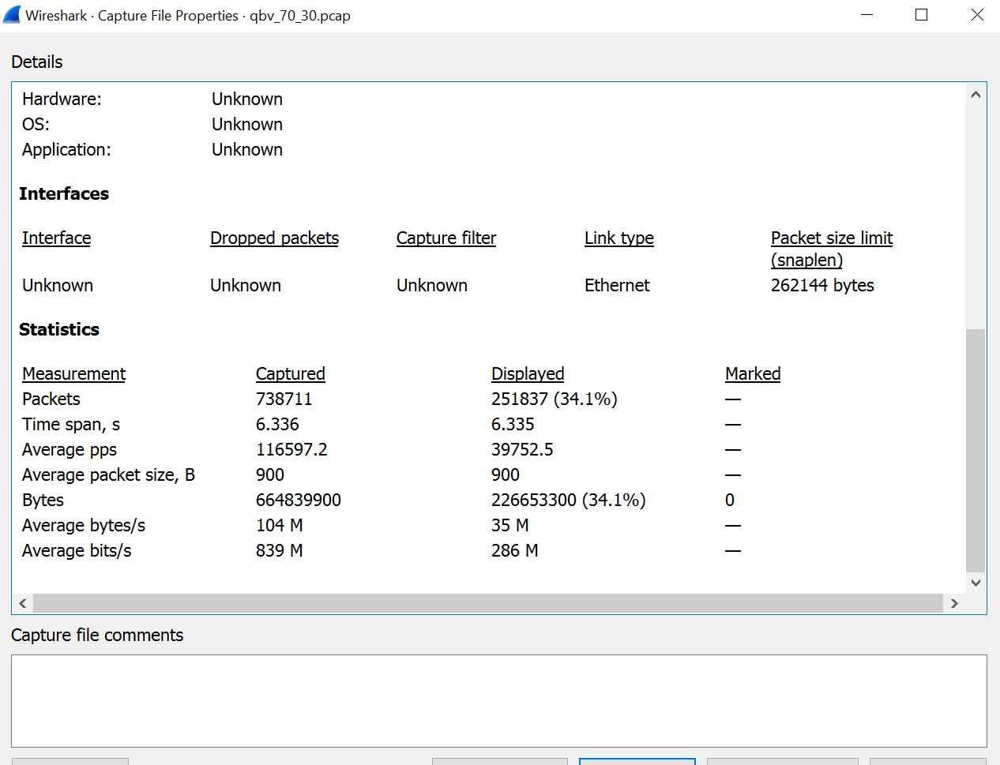.

5. Notice frame-premption - Optional(if preemption was enabled)

    * On CNC, set qbv configs for swp0 for Master(70% Mixed traffic and 30% Scheduled traffic)
        * cycle_time in to be entered nS. Max cycle time is 1sec.
        * cycle start time. Should be '0,' which starts traffic as soon as the talker is running.
        * gate list length can have MAX 256 entries. (gate list length > 0).
        * time for gate list entry to be entered in nS, should not be more the 8000000nS. Sets the time for which gate-state-value that is set will occupy (time > 0).
      ```
        # Example

        ubuntu@kria:~$ sudo /usr/bin/network-manager/xcnc_setup

                                      Hi!
                  Welcome to the TSN Network Management Engine
        Please choose one of the options below:
        Option 1: Create new node
        Option 2: Modify existing node
        Option 3: Show current nodes
        Option 4: Exit
        Please enter a number:
        2

        Please enter the node's MAC address
        00:0a:35:10:37:fa
        /etc/tsn-networkmanager/node_000a351037fa
        Qbv/fdb?
        qbv
        Enter the switch port whose qbv schedule needs to be modified:
        swp0
        Enter cycle time in nanoseconds, Maximum cycle time is 1 sec
        1000000
        Enter cycle start time (base time)
        0
        Enter gate list length:
        2
        Entry 1
        To open BE use state : 1
        To open ST use state : 4
        To open RES use state : 2
        Open both ST & BE state: 5(1+4)
        Enter gate state value
        5
        Enter time for the gate list entry
        700000
        Entry 2
        To open BE use state : 1
        To open ST use state : 4
        To open RES use state : 2
        Open both ST & BE state: 5(1+4)
        Enter gate state value
        4
        Enter time for the gate list entry
        300000
        10.0.0.106               ether   00:0a:35:10:37:fa   C                     eth0

        Sending /etc/tsn-networkmanager/node_000a351037fa/node_000a351037fa_qbv.json

        curl -T /etc/tsn-networkmanager/node_000a351037fa/node_000a351037fa_qbv.json tftp://10.0.0.106
        % Total    % Received % Xferd  Average Speed   Time    Time     Time  Current
                                 Dload  Upload   Total   Spent    Left  Speed
        100  9374    0     0  100  9374      0   767k --:--:-- --:--:-- --:--:--  767k
        100  9374    0     0  100  9374      0   746k --:--:-- --:--:-- --:--:--  746k
      ```

    * Verify if the schedule is set for ep(swp0) on Board1/Master
    ```
        sudo qbv_sched -g ep

        List length: 2
        Cycle time: 1000000
        Base time: 1684357652s 0ns
        List 0: Gate State: 3 Gate Time: 700000ns
        List 1: Gate State: 4 Gate Time: 300000ns
    ```

    * Start listener on Board2/Slave
    ```
        sudo tsn_listener &
    ```

    * Start talker on Board1/Master
    ```
        sudo tsn_talker -n -1 -l 900 -v 10 -p 4 &
        sudo tsn_talker -n -1 -l 1200 -v 10 -p 1 &
     ```

     * Kill listener/talker after a few seconds
     ```
        sudo killall tsn_listener       //Board2
        sudo killall tsn_talker         //Board1
    ```

    * Check the ethtool stats
    ```
    # Board1
    ethtool --include-statistics --show-mm eth2

    MAC Merge layer state for eth2:
    pMAC enabled: on
    TX enabled: on
    TX active: on
    TX minimum fragment size: 60
    RX minimum fragment size: 60
    Verify enabled: on
    Verify time: 127
    Max verify time: 127
    Verification status: SUCCEEDED
    Statistics:
        MACMergeFrameAssErrorCount: 0
        MACMergeFrameSmdErrorCount: 3
        MACMergeFrameAssOkCount: 0
        MACMergeFragCountRx: 0
        MACMergeFragCountTx: 13808
        MACMergeHoldCount: 1

    # Board2
    ethtool --include-statistics --show-mm eth2
    MAC Merge layer state for eth2:
    pMAC enabled: on
    TX enabled: on
    TX active: on
    TX minimum fragment size: 60
    RX minimum fragment size: 60
    Verify enabled: on
    Verify time: 127
    Max verify time: 127
    Verification status: SUCCEEDED
    Statistics:
        MACMergeFrameAssErrorCount: 0
        MACMergeFrameSmdErrorCount: 10
        MACMergeFrameAssOkCount: 13488
        MACMergeFragCountRx: 13808
        MACMergeFragCountTx: 0
        MACMergeHoldCount: 0
    ```
    ***Note***: MACMergeFragCountTx on board1/master and MACMergeFragCountRx on board2/slave should match on both sides.


### Enable frame Preemption - Optional

1. Check the current status.
     ```
        ethtool --include-statistics --show-mm eth2    //KR260
        ethtool --include-statistics --show-mm eth1    //KD240
     ```
      ***Note:*** Verify pMAC enabled: on. This means preemption is available. TX Enable and Active will be off at this point as boards are not communicating yet.

2. Restart lldpad service
     ```
        sudo systemctl restart lldpad
     ```
3. Enable transmit capabilities
     ```
        # KR260 commands
        sudo lldptool -i eth2 set-lldp adminStatus=rxtx
        sudo lldptool -i eth2 set-tlv -V addEthCaps enableTx=yes

        # KD240 commands
        sudo lldptool -i eth1 set-lldp adminStatus=rxtx
        sudo lldptool -i eth1 set-tlv -V addEthCaps enableTx=yes
     ```
      ***Note:*** Now TX Enable and Active should be ON automatically on both sides.
4. Check status
     ```
        ethtool --include-statistics --show-mm eth2      //KR260
        ethtool --include-statistics --show-mm eth1      //KD240
     ```
      ***Note:*** Notice TX Enable and TX Active are "on" now.
      Once preemption is enabled, it remains enabled on subsequent reboot as the configuration is stored in lldpad.conf. Delete `/var/lib/lldpad/lldpad.conf` to reset the configuration.


### Network Configuration 3 : KR260/KD240 and PC Workstation

A single KR260/KD240 board communicating with a PC workstation capable of TSN networking.  The PC workstation is using an I210 Ethernet Controller interface card to demonstrate functionality and features of TSN.

#### KR260/KD240 and PC Workstation: Board Setup

* Insert the microSD card containing the boot image into the microSD card slot (J11) on the Starter Kit.
* Connect JTAG/UART port (J4) of the KR260 carrier board to the development PC.
* Connect the TPH2 Pmod to the PMOD2 expansion connector (J18) of the KR260 carrier board.
* Connect Ethernet cable from PL ETH1 (J10 top for KR260)/(J25B top for KD240) Carrier Board  to Intel I210 NIC Ethernet port of the Linux host machine.
* Connect Power Supply to the 12V PWR DC barrel jack (J12) on the KR260/KD240 carrier board.

    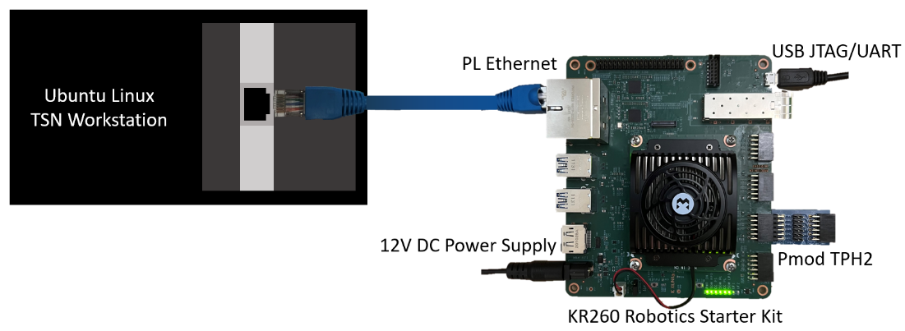

* Ensure to load the TSN accelerator/firmware (refer to step-7 'dynamically load the application package' from initial setup) before testing example application. If the firmware is already loaded, ignore this step and proceed.
    * KR260 firmware load command:
    ```bash
        sudo xmutil unloadapp
        sudo xmutil loadapp kr260-tsn-rs485pmod
    ```
    * KD240 firmware load command:
    ```bash
        sudo xmutil unloadapp
        sudo xmutil loadapp kd240-motor-ctrl-qei
    ```

* Setup Ethernet port on the target KR260/KD240 board by running the following commands within the USB-UART connected serial terminal, this sets the MAC/IP/VLAN on the EP and ETH port of the TSN switch IP.

    `source /usr/bin/net_setup.sh -b2 `

 **Workstation Configuration**

* The TSN networking interface (I210 interface) on the Linux host workstation  must be brought up and linuxptp needs to be installed to demonstrate PTP. To do this, on the Linux workstation, use `sudo ifconfig <i210 interface> up` command as shown in this example usage:

    `sudo ifconfig enp2s0 up `

* _Install ptpt4l on Workstation_

    `sudo apt install -y linuxptp`

#### Network Time Synchronization Workstation-KR260/KD240 (PTP Demo)

In this demo, KR260/KD240 sets its clock as slave and the Linux host workstation serves as the clock master. The KR260/KD240 clock syncs with the Linux host workstation clock after a brief synchronization period.

Using a text editor on the Linux TSN host workstation, create a new ptp4l configuration file with the following settings needed to launch ptp4l as the network clock master.

```text
    [global]

    transportSpecific       1
    priority1               248
    priority2               249
    ptp_dst_mac             01:80:C2:00:00:0E
    p2p_dst_mac             01:80:C2:00:00:0E
    logAnnounceInterval     1
    logSyncInterval         -3
    follow_up_info          1
    announceReceiptTimeout  3
    syncReceiptTimeout      3
    neighborPropDelayThresh 800
    min_neighbor_prop_delay -20000000
    network_transport       L2
    delay_mechanism         P2P
    tx_timestamp_timeout    10
```

* _Start ptp4l on the Linux TSN host workstation and specify_

    `sudo ptp4l -P -2 -H -i <i210 interface> -m -f ptp4l_master.conf >& ptplog & `

    `sudo ptp4l -P -2 -H -i enp2s0 -p /dev/ptp1 -m -f ptp4l_master.conf >& ptplog & `

> ***Note:*** In cases where there is more than one PTP device available, specify which one is to be used with the -p argument as shown in the following example usage:

* _Start ptp on KR260/KD240 in slave clock mode_
    `source /usr/bin/start_ptp.sh -s `

> ***Note:*** Ensure to run the ptp master before starting ptp slave as slave fails to sync when the grandmaster clock is not set. The sync takes about 30 seconds to complete.

**Observe Results**

* The file ptplog contains the saved ptp4l output to the file system on KR260/KD240. The rms value starts out high and trend downward to a single-digit value showing that the clocks are now in sync.

    

* To see the current status of PTP, run the following command to exit log view when finished.

    `tail -f .local/log/ptplog`

#### Network Time Shaper Function (other 802.1Qbv Demo)

This demo allots a time slot for Scheduled Traffic (ST) and Best Effort (BE) traffic and it can be visualized on an oscilloscope.  For a cycle time period of 1ms, ST traffic is sent for 700us and BE traffic for 300us.  Wireshark on the Linux host workstation listens for packets.  On the KR260 board, the application sets up time slots for the traffic classes.  Packets are generated in continuous mode for both traffic types.  Wireshark monitors the incoming packets for scheduled and best-effort traffic exposed by the TSN IP.

An oscilloscope or Analog Discovery 2 device can also be used to monitor Tlast Tx ST (P7) and Tlast Tx EP (P9) on KR260/KD240 board to view the distribution.
Oscilloscope Setup (optional)

* Connect P7 on the Test Pmod of KR260 to Channel1 of the oscilloscope - Tlast Tx ST
* Connect P9 on the Test Pmod of KR260 to Channel2 of the oscilloscope - Tlast Tx EP
* Set up triggers on Channel1 and Channel2 with an OR condition and set the time scale interval to 1 millisecond:

    
* The Analog Discovery 2 can be connected to KR260 using these connections for observing the scheduled traffic:

    

* Start Wireshark on the Linux host machine and select I210 interface to see traffic data

    `wireshark &`

* Start transmitting packets from the KR260 board

    `source /opt/xilinx/tsn-examples/bin/start_qbv_test.sh -tx`

* The talker on KR260 runs for 30 seconds and exits automatically

**Observe Results**

* The scope shot shows an approximate Scheduled traffic (Channel 1 yellow) and Best Effort traffic (Channel 2 green) distribution.

    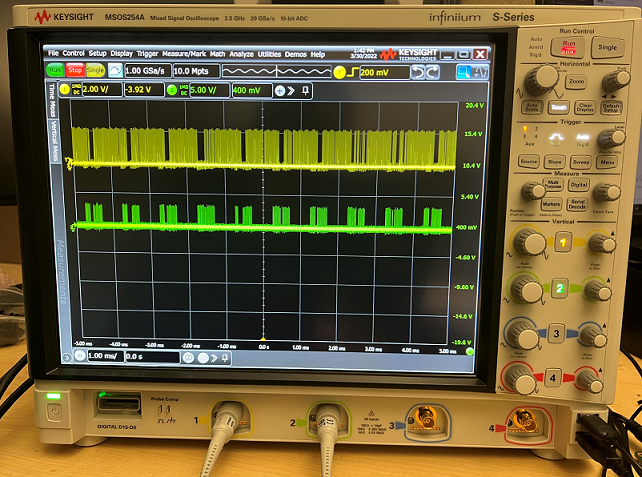

> ***Note:***  The distribution will not be clean because this is monitoring the data going into the TSN IP before it is scheduled to go out on the Ethernet MAC.

* Observe that there are two sets of packets within the capture, one set with packet length=900, another set with packet length=800.

    

* Click on a packet with length=900 bytes and observe the vlan ID=10, Priority (PCP/PRI=4) where a packet with PCP=4 indicates it is Scheduled traffic.

    

* Click on a packet with length=800 bytes and observe the vlan ID=20, Priority (PCP/PRI=1) where a packet with PCP=1 indicates it is Best Effort traffic.

    

    Wireshark trace shows a traffic distribution of 70% Scheduled traffic and 30% Best Effort traffic.


### Communication using RS485

The K26 SOM has the capability to perform as an advanced and highly integrated gateway for legacy industrial networking protocols (those using RS485/Modbus) to more modern industrial networking infrastructure (such as TSN) and this application serves as an example of how to interface to a remote temperature sensor for capturing data.  This is analogous to integrating in legacy, but still functional, capital equipment to reduce total replacement costs within factory retrofits and technology upgrades.

**NOTE**: This test is not applicable for KD240 via PMOD-RS485

#### RS485: Board Setup

KR260:
* Connect the Pmod RS485 to the PMOD1 expansion connector (J2) of the KR260 carrier board. Be sure to connect this to the bottom row of pins (ones labeled 2,4,6,8,10, and 12) since the module is a 1x6 header connecting to a 2x6 connector on KR260.

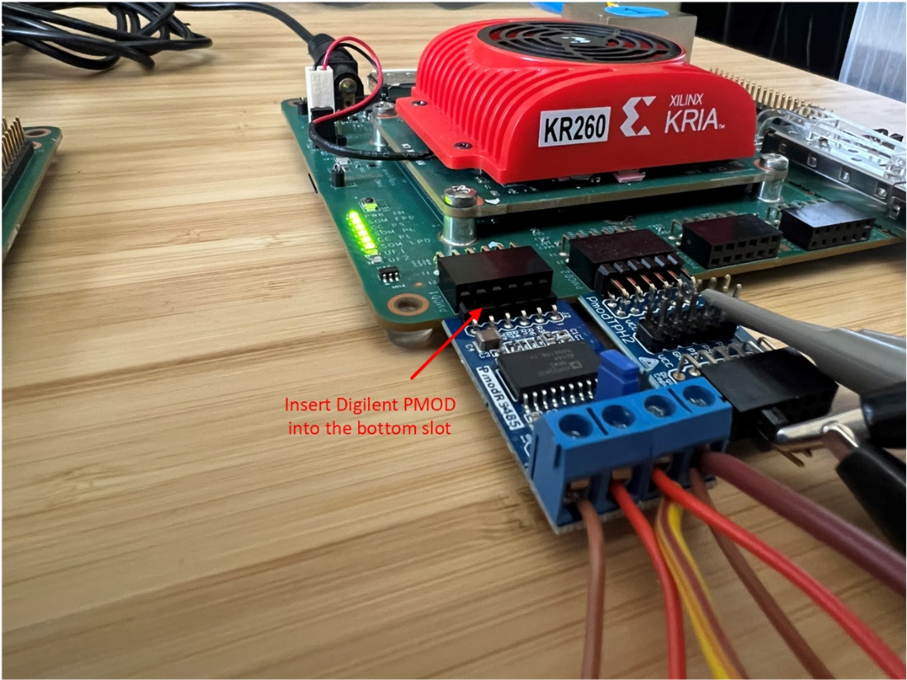

* Connect the Temperature sensor and PMOD RS485 using prototyping wire (18 AWG works well) as shown in the following figure:


* Connect a 12 VDC supply to power the RS485 temperature sensor using GND and VIN terminals.


* Connect Power Supply to the 12V PWR DC barrel jack (J12) on the KR260 carrier board.

KD240:
* Connect the RS485 Temperature and Humidity sensor as below on the J22 Connector on the KD240. Obtain a separate 12V power supply to connect the two loose jumpers as shown in the following image, one to GND(black wire in image) and the other to 12V Supply (white wire in image).


* Connect the Temperature and humidity sensor to the J22 euromag connector as shown below


### RS485 Temperature/Humidity Sensor Demo

In this demo, the pmod-test application probes the temperature sensor connected and displays the captured values on the serial terminal.

* Ensure to load the TSN accelerator/firmware (refer to step-7 'dynamically load the application package' from initial setup) before testing example application. If the firmware is already loaded, ignore this step and proceed.
    * KR260 firmware load command:
    ```bash
        sudo xmutil unloadapp
        sudo xmutil loadapp kr260-tsn-rs485pmod
    ```
    * KD240 firmware load command:
    ```bash
        sudo xmutil unloadapp
        sudo xmutil loadapp kd240-motor-ctrl-qei
    ```
* Probe sensor via RS485 interface.

* Execute binary:
    * KR260 command - `pmod-rs485-test`
    * KD240 command - `pmod-rs485-test /dev/ttyPS0`

**Observe Results**

The output on the serial terminal should match the value displayed on the seven-segment LED display of the sensor.


> ***Note:***  Occasionally, erroneous values (for example 3276.8) are reported for temperature/humidity sensor data and this is due to error in the sensor itself, which can be ignored and the test reruns to clear the error.
>
> ```
> reg[0]=32768 (0x8000)
> reg[1]=32768 (0x8000)
> Temperature: 3276.8 Deg C
> Humidity: 3276.8 %
> ```
> For reference, here is the register map of the sensor:
> 


### CAN Communication Setup and Demonstration

The application extends its functionality to support CAN communication by interfacing with
[PMOD CAN](https://digilent.com/reference/pmod/pmodcan/start) devices. This additional feature
allows seamless communication between devices through the CAN interface, enabling efficient
data exchange for various applications.

#### CAN: Board Setup

The configuration requires a setup involving two Kria boards, either for communication between
two KR260 boards or between a KR260 board and a KD240 board.

1. KR260-KR260 Setup

Connect the PMOD-CAN test point headers to the J19 (PMOD 3) connector on both KR260 boards.
Connect the PMOD-CAN devices on both boards using jumper wires as shown below:
- Connect GND on J19 (KR260 board 1) to GND on J19 (KR260 board 2)
- Connect CANH on J19 (KR260 board 1) to CANH on J19 (KR260 board 2)
- Connect CANL on J19 (KR260 board 1) to CANL on J19 (KR260 board 2)


2. KR260-KD240 Setup

Connect the PMOD-CAN test point headers to the J19 (PMOD 3) connector on KR260 board.
Connect the PMOD-CAN device on KR260 board to the CAN 2.0 J18 connector on KD240 board
using jumper wires as shown below:
- Connect GND on J19 (KR260 board 1) to GND on J18 (KD240 board 2)
- Connect CANH on J19 (KR260 board 1) to CANH on J18 (KD240 board 2)
- Connect CANL on J19 (KR260 board 1) to CANL on J18 (KD240 board 2)

> ***Note:*** PMOD CAN device is required for KR260 only. For KD240, the PS CAN port J18 is
used. 

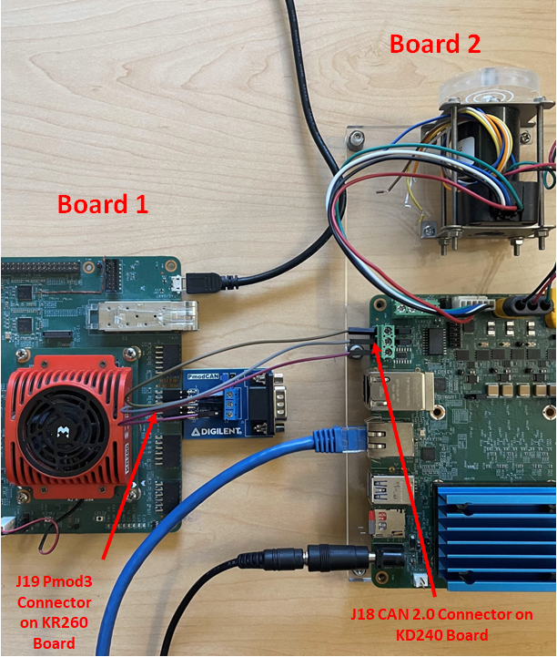


#### CAN Communication Demo

This tutorial provides a step-by-step guide to run a demo of CAN communication between two
Kria boards using the CAN interface. It details the necessary packages and commands
to establish communication, send, and receive messages. Note that this feature is an additional
capability provided by the application to support CAN communication.

* Install the necessary packages on both devices:
    ```bash
	sudo apt update
	sudo apt install can-utils   
    ```

* Ensure to load the TSN accelerator/firmware (refer to step-7 'dynamically load the application
package' from initial setup) before testing example application. If the firmware is already
loaded, ignore this step and proceed.
    * KR260 firmware load command:
    ```bash
        sudo xmutil unloadapp
        sudo xmutil loadapp kr260-tsn-rs485pmod
    ```
    * KD240 firmware load command:
    ```bash
        sudo xmutil unloadapp
        sudo xmutil loadapp kd240-motor-ctrl-qei
    ```
* Verify CAN device enumeration on both the boards:
    ```bash
	ip link show
    ```
    Ensure that 'can0' node is listed to confirm that the CAN device is recognized.
    An example output when run on KR260:
    ```bash
	ubuntu@kria:~$ ip link show
	1: lo: <LOOPBACK,UP,LOWER_UP> mtu 65536 qdisc noqueue state UNKNOWN mode DEFAULT group default qlen 1000
    	link/loopback 00:00:00:00:00:00 brd 00:00:00:00:00:00
	11: eth0: <NO-CARRIER,BROADCAST,MULTICAST,UP> mtu 1500 qdisc mq state DOWN mode DEFAULT group default qlen 1000
    	link/ether 00:0a:35:10:38:7d brd ff:ff:ff:ff:ff:ff
	12: eth1: <BROADCAST,MULTICAST,UP,LOWER_UP> mtu 1500 qdisc mq state UP mode DEFAULT group default qlen 1000
    	link/ether 00:0a:35:10:38:7e brd ff:ff:ff:ff:ff:ff
	13: docker0: <NO-CARRIER,BROADCAST,MULTICAST,UP> mtu 1500 qdisc noqueue state DOWN mode DEFAULT group default
    	link/ether 02:42:ba:13:d1:63 brd ff:ff:ff:ff:ff:ff
	14: ep: <BROADCAST,UP,LOWER_UP> mtu 1500 qdisc mq state UNKNOWN mode DEFAULT group default qlen 1000
    	link/ether 00:0a:35:00:01:05 brd ff:ff:ff:ff:ff:ff
	15: eth2: <NO-CARRIER,BROADCAST,UP> mtu 1500 qdisc mq state DOWN mode DEFAULT group default qlen 1000
    	link/ether 00:0a:35:00:01:0e brd ff:ff:ff:ff:ff:ff
	16: eth3: <NO-CARRIER,BROADCAST,UP> mtu 1500 qdisc mq state DOWN mode DEFAULT group default qlen 1000
    	link/ether 00:0a:35:00:01:0f brd ff:ff:ff:ff:ff:ff
	17: can0: <NOARP,ECHO> mtu 16 qdisc noop state DOWN mode DEFAULT group default qlen 10
    	link/can
    ```
* Setup the CAN interface on both the boards:
    ```bash
	sudo ip link set can0 type can bitrate 100000
	sudo ip link set can0 txqueuelen 1000
	sudo ip link set can0 up
    ```

* Verify CAN communication:

  Start monitoring messages on board 2
    ```bash
	sudo candump can0
    ```
  Send CAN message from board 1
    ```bash
	sudo cansend can0 123#1122334455667788
    ```
  An example output on receiving the message on board 2 is shown below:
    ```bash
	ubuntu@kria:~$ sudo candump can0

  	can0  123   [8]  11 22 33 44 55 66 77 88
    ```
  Similarly, repeat the above steps by sending the message on board 2 and monitoring on board 1.
  This ensures that both sending and receiving functionality is verified on both devices.


* Bring down the CAN interfaces on both boards after testing:
   ```bash
	sudo ip link set can0 down
   ```

The demo provides users with a foundation to explore and develop CAN-based applications, leveraging
the communication capability provided by the platform. Integrating this with ROS applications allows
for efficient and reliable real-time data exchange, enhancing performance and communication.

## Known issues

Following known issues and their remedies that can be encountered and implemented while testing the above application.

* Repeated broadcast on ping

* PTP timeouts with heavy traffic

For the above two issues, refer to the documentation provided under the section "Known issues and troubleshooting" from the AMD TSN solution wiki page [here](https://xilinx-wiki.atlassian.net/wiki/spaces/A/pages/25034864/Xilinx+TSN+Solution).


## Next Steps

* [Software Architecture of the Platform](sw_arch_platform.md)
* Go back to the [KR260 design start page](../ros2_multinode_communication_via_tsn_landing)

<!---

Licensed under the Apache License, Version 2.0 (the "License"); you may not use this file except in compliance with the License.

You may obtain a copy of the License at http://www.apache.org/licenses/LICENSE-2.0.


Unless required by applicable law or agreed to in writing, software distributed under the License is distributed on an "AS IS" BASIS, WITHOUT WARRANTIES OR CONDITIONS OF ANY KIND, either express or implied. See the License for the specific language governing permissions and limitations under the License.

-->

<p class="sphinxhide" align="center">Copyright&copy; 2023 Advanced Micro Devices, Inc.</p>
